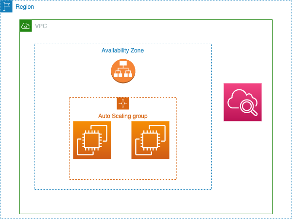

# ELB Example

Requirements:
- I have web server and I want to deploy it in the scalable environment 

What will see in the templates:
- Create Launch Configuration.
- Create Load Balancer.
- Security Group to enable you to access the ec2 using SHH.
- Created autoscaling group to manage any unplanned traffic. 

How can I use it? 
- Upload the templates files except the root on S3 bucket 
- Run `cloudformation -template-file [link-root-template] BucketURLParam=[Bucket-URL-include-child-templates] KeyName=[Pair-key-name]`
 